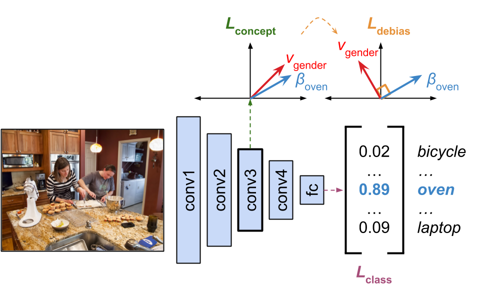

# MetaOrthogonalization <br>
[Kurtis Evan David](https://kurtisdavid.github.io), 
[Qiang Liu](https://www.cs.utexas.edu/~lqiang/), 
[Ruth Fong](https://ruthcfong.github.io/)
## [[Paper]](https://arxiv.org/abs/2011.07453)

<div align="center">
  
</div>

## Citation
```bibtex
@article{david2020debiasing,
      title={Debiasing Convolutional Neural Networks via Meta Orthogonalization},
      author={Kurtis Evan David and Qiang Liu and Ruth Fong},
      year={2020},
      journal={arXiv preprint arXiv:2011.07453},
}
```

## Overview
This is the official implementation of Meta Orthogonalization in [PyTorch](https://pytorch.org/).
Our main idea is to debias convolutional networks by making downstream concepts be orthogonal to a learned bias direction. 
This is directly inspired by similar methods in NLP by [Bolukbasi et al. (2016)](https://arxiv.org/abs/1607.06520).

## Required Libraries
To successfully run the code in this repo, make sure you have the following libraries installed:
* PyTorch 1.5.0 (CUDA 10.1)
* [higher](https://github.com/facebookresearch/higher)
* [bam](https://github.com/google-research-datasets/bam)


## Acknowledgement
We would like to thank Tianlu Wang for collaborating and providing more details with [adversarial debiasing](https://arxiv.org/abs/1811.08489) and their models. Please also cite their paper if you use this codebase for COCO, as we use theirs provided [here](https://github.com/uvavision/Balanced-Datasets-Are-Not-Enough).

## Contact
If you have any questions, please contact us through kurtis.e.david(at)gmail.com.
